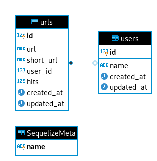

# brq-renault-test
Avaliação aplicada no processo seletivo da <b>BRQ</b> para uma vaga de <b>Desenvolvedor NodeJS</b> na <b>Renault</b>.
  

## Descrição
O projeto envolve a criação de <b>serviços RESTful</b> que permitam a geração de <b>URLs curtas</b>, mediante o envio da URL principal.
  

## Requisitos
Para que seja realizada a instalação, construção, execução e testes são necessárias as seguintes tecnologias previamente instaladas que devem ser verificadas através do <b>terminal(Linux/MacOS)</b> ou <b>CommandShell/CMD/PowerShell (Windows)</b>:

- <b>Git</b>

    Para confirmar se já está instalado: 
<code>git --version</code>

    Caso ainda não esteja instalado:
https://git-scm.com/book/pt-br/v2/Come%C3%A7ando-Instalando-o-Git
  

- <b>Make</b>

    Para confirmar se já está instalado: 
    <code>make --version</code>

    Caso ainda não esteja instalado: 

    - <b>Linux:</b> 
<code>sudo apt-get install build-essential</code>

    - <b>Windows</b>
http://gnuwin32.sourceforge.net/packages/make.htm
  

- <b>Docker:</b>

    Para confirmar se já está instalado: 
<code>docker --version</code>

    Caso ainda não esteja instalado:
https://www.docker.com/community-edition#/download

- <b>Docker-compose</b>:
Normalmente, ao instalar o Docker, o Compose também é instalado. Para confirmar se já está instalado: 
<code>docker-compose --version</code>

    Caso ainda não esteja instalado:
https://docs.docker.com/compose/install/
  

## Arquitetura
Foi desenvolvida uma arquitetura voltada para microsserviços com os serviços separados em containers Docker que podem ser escalados mediante a demanda necessária. A estrutura básica foi desenvolvida em NodeJS com Express, ambos responsáveis pela gestão e roteamento das requisições HTTP usando REST.
Foi criada uma pequena estrutura de dados relacionais com Postgres também alocado em um container específico contendo os dados estatísticos e um hash curto, único e aleatório gerado automaticamente.
  

## Tecnologias:
- <b>NodeJS</b>: linguagem Javascript backend voltada para a construção das API's;
- <b>Postgres</b>: banco de dados relacional utilizado para armazenamento as informações estatísticas;
  

## Dependências:
- Gerais
    - <b>body-parser</b>: suporte ao parser de conteúdo para requisições HTTP;
    - <b>cors</b>: autentidação no redirecionamento de domínio;
    - <b>dotenv</b>: leitura de variáveis de ambiente a partir de arquivo .env;
    - <b>express</b>: roteamento e manipulação HTTP para API REST;
    - <b>pg</b>: apoio na utilização do Postgres;
    - <b>sequelize</b>: persistência de dados para Postgres;
    - <b>shortid</b>: gerador de ids curtos;
    - <b>valid-url</b>: validação do formato URL;
    - <b>youch</b>: tratamento de erros e exceções;
    - <b>yup</b>: validação de dados postados;

- Específicas do ambiente de desenvolvimento
    - <b>eslint</b>: formatação e validação de sintaxe;
    - <b>nodemon</b>: monitora o serviço HTTP do node;
    - <b>prettier</b>: formatação do código;
    - <b>sequelize-cli</b>: execução de testes e migrations através da persistência com Postgres;
    - <b>sucrase</b>: adaptação do código para ES6;
  

## Instalação
Atualizar as informações no arquivo .env.example e renomeá-lo para .env. Após isso, através do terminal executar: 
<code>make install</code> 

Após o final da instalação, acessar os serviços através do endpoint: 
http://localhost:3333/

Exemplo: 
http://localhost:3333/users
  

## Testes
<code>make test</code>
  

## Modelo de dados

  

## GUI Teste API's
Foi utilizado o [Insomnia](https://insomnia.rest/) para teste manual de cada serviço da API. Arquivo JSON contendo as informações, bem como os parâmetros utilizados disponíveis no repositório em [./public/insomnia-encurtador-url.json](./public/insomnia-encurtador-url.json) para importação, caso seja conveniente.

  

## Referências
https://codeforgeek.com/url-shortener-node-js-redis/ 
https://scalegrid.io/blog/how-to-build-a-url-shortener-with-node-js-and-mongodb/ 
https://blog.hotmart.com/pt-br/encurtador-de-url/ 
https://www.codechain.com.br/2018/11/29/aws-experience-encurtador-de-url/ 
https://dfilitto.com.br/ferramentas/encurtador-de-link/ 
https://www.encurtador.com.br/ 
https://developer.aliyun.com/mirror/npm/package/node-short-url 
